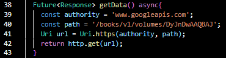

## **(2141720047) Yasmine Navisha Andhani - TI_3G**
Link Github : 

# Jobsheet Pertemuan 12 - Asynchronous di Flutter

***
## Praktikum 1: Mengunduh Data dari Web Service (API)

### Langkah 1: Buat Project Baru
Buatlah sebuah project flutter baru dengan nama books di folder src week-12 repository GitHub Anda.

Kemudian Tambahkan dependensi http dengan mengetik perintah berikut di terminal.

### Langkah 2: Cek file pubspec.yaml
Jika berhasil install plugin, pastikan plugin http telah ada di file pubspec ini seperti berikut.

### Langkah 3: Buka file main.dart
Ketiklah kode seperti berikut ini.

**Soal 1**: Tambahkan nama panggilan Anda pada title app sebagai identitas hasil pekerjaan Anda.

### Langkah 4: Tambah method getData()
Tambahkan method ini ke dalam class _FuturePageState yang berguna untuk mengambil data dari API Google Books.

**Soal 2**: 
* Carilah judul buku favorit Anda di Google Books, lalu ganti ID buku pada variabel path di kode tersebut. 

* Kemudian cobalah akses di browser URI tersebut dengan lengkap seperti ini. Jika menampilkan data JSON, maka Anda telah berhasil. Lakukan capture milik Anda dan tulis di README pada laporan praktikum. Lalu lakukan commit dengan pesan "W12: Soal 2".

### Langkah 5: Tambah kode di ElevatedButton
Tambahkan kode pada onPressed di ElevatedButton seperti berikut.

Lakukan run aplikasi Flutter Anda. Anda akan melihat tampilan akhir seperti gambar berikut. Jika masih terdapat error, silakan diperbaiki hingga bisa running.

**Soal 3:**
* Jelaskan maksud kode langkah 5 tersebut terkait substring dan catchError!

Jawab: 

substring() adalah metode untuk mengambil substring dari string. Substring adalah bagian dari string yang dimulai dari indeks tertentu dan berakhir pada indeks tertentu. Metode substring() menerima dua parameter, yaitu indeks awal dan indeks akhir. Indeks awal adalah indeks karakter pertama yang ingin diambil, dan indeks akhir adalah indeks karakter terakhir yang ingin diambil. catchError() adalah metode untuk menangani kesalahan. Metode catchError() menerima satu parameter, yaitu fungsi yang akan dijalankan jika terjadi kesalahan. Fungsi tersebut akan menerima objek kesalahan sebagai parameter. Kode di atas menggunakan substring() untuk mengambil 450 karakter pertama dari respons API. Jika terjadi kesalahan saat mengambil respons API, maka kode tersebut akan menggunakan catchError() untuk menampilkan pesan kesalahan "An error occurred".

* Capture hasil praktikum Anda berupa GIF dan lampirkan di README. Lalu lakukan commit dengan pesan "W12: Soal 3".

Jawab:

## Praktikum 2: Menggunakan await/async untuk menghindari callbacks

### Langkah 1: Buka file main.dart
Tambahkan tiga method berisi kode seperti berikut di dalam class _FuturePageState.

### Langkah 2: Tambah method count()
Lalu tambahkan lagi method ini di bawah ketiga method sebelumnya.

### Langkah 3: Panggil count()
Lakukan comment kode sebelumnya, ubah isi kode onPressed() menjadi seperti berikut.

### Langkah 4: Run
Akhirnya, run atau tekan F5 jika aplikasi belum running. Maka Anda akan melihat seperti gambar berikut, hasil angka 6 akan tampil setelah delay 9 detik.

