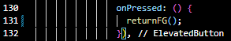

## **(2141720047) Yasmine Navisha Andhani - TI_3G**
Link Github : 

# Jobsheet Pertemuan 12 - Asynchronous di Flutter

***
## Praktikum 1: Mengunduh Data dari Web Service (API)

### Langkah 1: Buat Project Baru
Buatlah sebuah project flutter baru dengan nama books di folder src week-12 repository GitHub Anda.

Kemudian Tambahkan dependensi http dengan mengetik perintah berikut di terminal.

### Langkah 2: Cek file pubspec.yaml
Jika berhasil install plugin, pastikan plugin http telah ada di file pubspec ini seperti berikut.

### Langkah 3: Buka file main.dart
Ketiklah kode seperti berikut ini.

**Soal 1**: Tambahkan nama panggilan Anda pada title app sebagai identitas hasil pekerjaan Anda.

### Langkah 4: Tambah method getData()
Tambahkan method ini ke dalam class _FuturePageState yang berguna untuk mengambil data dari API Google Books.

**Soal 2**: 
* Carilah judul buku favorit Anda di Google Books, lalu ganti ID buku pada variabel path di kode tersebut. 

* Kemudian cobalah akses di browser URI tersebut dengan lengkap seperti ini. Jika menampilkan data JSON, maka Anda telah berhasil. Lakukan capture milik Anda dan tulis di README pada laporan praktikum. Lalu lakukan commit dengan pesan "W12: Soal 2".

### Langkah 5: Tambah kode di ElevatedButton
Tambahkan kode pada onPressed di ElevatedButton seperti berikut.

Lakukan run aplikasi Flutter Anda. Anda akan melihat tampilan akhir seperti gambar berikut. Jika masih terdapat error, silakan diperbaiki hingga bisa running.

**Soal 3:**
* Jelaskan maksud kode langkah 5 tersebut terkait substring dan catchError!

Jawab: 

substring() adalah metode untuk mengambil substring dari string. Substring adalah bagian dari string yang dimulai dari indeks tertentu dan berakhir pada indeks tertentu. Metode substring() menerima dua parameter, yaitu indeks awal dan indeks akhir. Indeks awal adalah indeks karakter pertama yang ingin diambil, dan indeks akhir adalah indeks karakter terakhir yang ingin diambil. catchError() adalah metode untuk menangani kesalahan. Metode catchError() menerima satu parameter, yaitu fungsi yang akan dijalankan jika terjadi kesalahan. Fungsi tersebut akan menerima objek kesalahan sebagai parameter. Kode di atas menggunakan substring() untuk mengambil 450 karakter pertama dari respons API. Jika terjadi kesalahan saat mengambil respons API, maka kode tersebut akan menggunakan catchError() untuk menampilkan pesan kesalahan "An error occurred".

* Capture hasil praktikum Anda berupa GIF dan lampirkan di README. Lalu lakukan commit dengan pesan "W12: Soal 3".

Jawab:

## Praktikum 2: Menggunakan await/async untuk menghindari callbacks

### Langkah 1: Buka file main.dart
Tambahkan tiga method berisi kode seperti berikut di dalam class _FuturePageState.

### Langkah 2: Tambah method count()
Lalu tambahkan lagi method ini di bawah ketiga method sebelumnya.

### Langkah 3: Panggil count()
Lakukan comment kode sebelumnya, ubah isi kode onPressed() menjadi seperti berikut.

### Langkah 4: Run
Akhirnya, run atau tekan F5 jika aplikasi belum running. Maka Anda akan melihat seperti gambar berikut, hasil angka 6 akan tampil setelah delay 9 detik.

**Soal 4**
* Jelaskan maksud kode langkah 1 dan 2 tersebut!

    Jawab: Merupakan kode Dart yang terdiri dari tiga fungsi asynchronous, yaitu returnOneAsync(), returnTwoAsync(), dan returnThreeAsync(). Ketiga fungsi ini mengembalikan nilai int dan menggunakan Future.delayed() untuk menunda eksekusi selama 3 detik.

* Capture hasil praktikum Anda berupa GIF dan lampirkan di README. Lalu lakukan commit dengan pesan "W12: Soal 4".

## Praktikum 3: Menggunakan Completer di Future

### Langkah 1: Buka main.dart
Pastikan telah impor package async berikut.

### Langkah 2: Tambahkan variabel dan method
Tambahkan variabel late dan method di class _FuturePageState seperti ini.

### Langkah 3: Ganti isi kode onPressed()
Tambahkan kode berikut pada fungsi onPressed(). Kode sebelumnya bisa Anda comment.

**Soal 5**
* Jelaskan maksud kode langkah 2 tersebut!

    Jawab :
    1. Variabel completer Variabel completer adalah variabel late dari tipe Completer. Variabel ini digunakan untuk menyimpan hasil dari perhitungan angka 42.
    2. Method getNumber() Method getNumber() mengembalikan nilai dari variabel completer. Method ini memiliki dua langkah: a. Inisialisasi variabel completer dengan nilai baru. b. Memanggil method calculate() untuk menghitung angka 42.
    3. Method calculate() Method calculate() menggunakan Future.delayed() untuk menunggu 5 detik sebelum menyelesaikan perhitungan angka 42. Setelah 5 detik, method ini akan memanggil method completer.complete() untuk menyelesaikan perhitungan dan mengembalikan nilai 42 ke variabel completer

* Capture hasil praktikum Anda berupa GIF dan lampirkan di README. Lalu lakukan commit dengan pesan "W12: Soal 5".

### Langkah 5: Ganti method calculate()
Gantilah isi code method calculate() seperti kode berikut, atau Anda dapat membuat calculate2()

### Langkah 6: Pindah ke onPressed()
Ganti menjadi kode seperti berikut.

**Soal 6**
* Jelaskan maksud perbedaan kode langkah 2 dengan langkah 5-6 tersebut!
    Jawab: Langkah 5 Pada langkah 5, kita mengganti isi dari method calculate(). Method calculate() sebelumnya menggunakan await Future.delayed(const Duration(seconds: 5)); untuk menunggu 5 detik sebelum menyelesaikan perhitungan angka 42. Pada langkah 6, kita mengganti kode di method onPressed(). Kode ini menggunakan then() dan catchError() untuk menangani hasil dari method getNumber(). Jika tidak terjadi kesalahan, maka method ini akan memanggil method setState() untuk memperbarui state dari widget. Jika terjadi kesalahan, maka method ini akan memanggil method setState() untuk memperbarui state dari widget dan menampilkan pesan kesalahan.

* Capture hasil praktikum Anda berupa GIF dan lampirkan di README. Lalu lakukan commit dengan pesan "W12: Soal 6".

## Praktikum 4: Memanggil Future secara paralel

### Langkah 1: Buka file main.dart
Tambahkan method ini ke dalam class _FuturePageState

### Langkah 2: Edit onPressed()
Anda bisa hapus atau comment kode sebelumnya, kemudian panggil method dari langkah 1 tersebut.

### Langkah 3: Run
Anda akan melihat hasilnya dalam 3 detik berupa angka 6 lebih cepat dibandingkan praktikum sebelumnya menunggu sampai 9 detik.

**Soal 7**
* Capture hasil praktikum Anda berupa GIF dan lampirkan di README. Lalu lakukan commit dengan pesan "W12: Soal 7".

    

### Langkah 4: Ganti variabel futureGroup
Anda dapat menggunakan FutureGroup dengan Future.wait seperti kode berikut.

**Soal 8**
* Jelaskan maksud perbedaan kode langkah 1 dan 4!

    Jawab: Perbedaan kode langkah 1 dan kode langkah 4 adalah pada penggunaan variabel futureGroup. Pada langkah 1, variabel futureGroup digunakan untuk menampung FutureGroup. FutureGroup adalah sebuah objek yang dapat digunakan untuk mengelompokkan beberapa Future bersama-sama. Sedangkan pada langkah 4, variabel futureGroup diganti dengan Future.wait(). Future.wait() adalah sebuah fungsi yang dapat digunakan untuk menunggu beberapa Future selesai dijalankan.

## Praktikum 5: Menangani Respon Error pada Async Code

### Langkah 1: Buka file main.dart
Tambahkan method ini ke dalam class _FuturePageState